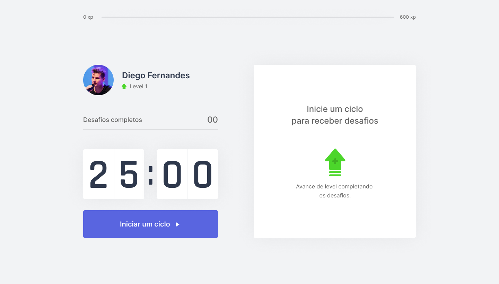

<header align="center">
  

<h1>Move.it</h1>

<p>Projeto desenvolvido com Nextjs durante a Next Level Week da Rocketseat - Trilha React</p>
<p>Acesse em: <a target="_blank" href="https://moveit-fawn-kappa.vercel.app/">https://moveit-fawn-kappa.vercel.app/</a></p>

  <span>
    <a href="#intro">Introdução</a> |
    <a href="#tech">Tecnologias</a> |
    <a href="#tech">Como usar</a> |
    <a href="#licence">Licença</a>
  </span>
</header>

<h2>Introdução</h2>

Se você já passou horas trabalhando sem descanso, já deve ter ficado com dores pelo corpo e cansaço visual.

A ideia do Move.it é te ajudar a praticar exercícios para o corpo e para os olhos durante os seus intervalos de foco.

<h2>Tecnologias</h2>
<ul>
  <li>Nextjs</li>
  <li>Typescript</li>
  
</ul>
<h2>Como usar</h2>

Clone o projeto

```shell
git clone https://github.com/lorenasg1/nlw-moveit.git
```

Instale as dependências 

```shell
npm install

ou

yarn
```

Execute o projeto na sua máquina

```shell
npm start

ou

yarn start
```

<h2>Licença</h2>

Esse projeto está sob a licença <a href="https://github.com/lorenasg1/nlw-moveit/blob/main/LICENSE">MIT</a>.
